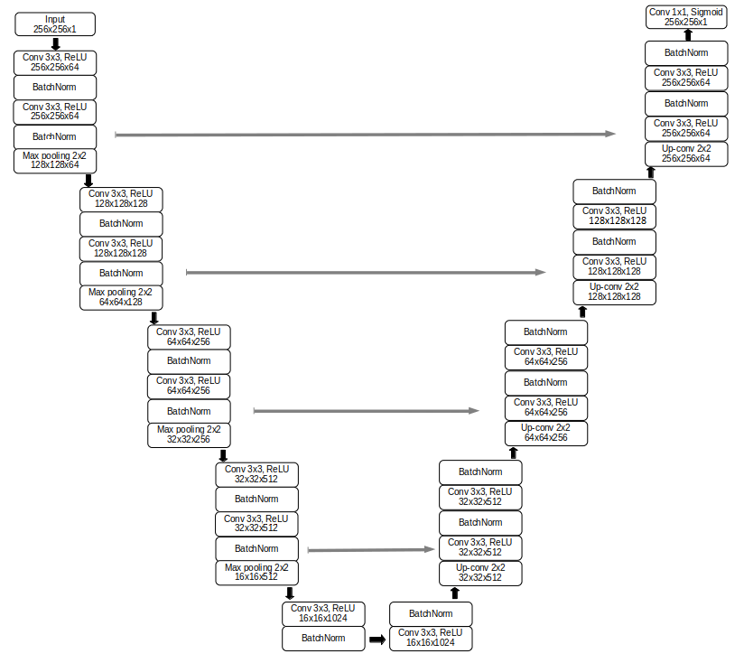

# **Medical Segmentation**

In the repository there is a final project (the second of two) made during advanced image processing classes at the Poznan University of Technology. The aim of the project was brain segmentation from sequence T1 type of MRI.

## **Requirements**
- python 3.6.9
- numpy 1.18.5
- opencv-python 4.2.0
- scikit-learn 0.23.1
- tensorflow-gpu 1.14.0
- keras 2.3.1
- Pillow 7.1.2
- nibabel 3.1.0
- matplotlib 3.2.1

## **Dataset**
In the dataset were scans in medical *.nii format. I split whole dataset into train and validation dataset. I used nibabel library to load data from scans. 
From three dimensional matrix, which I obtained from loading scan, I could extract slices from x axis and saved it as images in png format. These images were used as input to network. 

Loaded images from dataset was normalized and their size was changed to 256x256, after these operations I get data with the same range of values and in the same size.  

## **Network architecture**
I used Unet architecture that is shown below. The network was trained on data from x axis. Then for every slice in the 3D matrix from test dataset the prediction was execute. These predictions were used to create the final brain mask (3D matrix). 

## **Result**
To evaluate model performance I used Dice as metric and DiceLoss as loss.

Dice scores for example scans from test dataset:
||Dice score|Dice loss|
|:----:|:--------:|:-------:|
| 1    |  0.9751  |  0.0249 |
| 2    |  0.9847  |  0.0153 |
| 3    |  0.9805  |  0.0195 |
| 4    |  0.9777  |  0.0223 |

Average Dice scores for validation and test dataset:
|         |Validation |Test  |
|:-------:|:---------:|:----:|
|Dice     |  0.9836   |0.9762|
|Dice loss|  0.0164   |0.0238|

Predicted brain masks for example slices:

